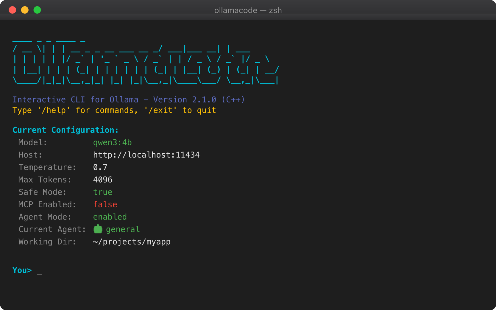
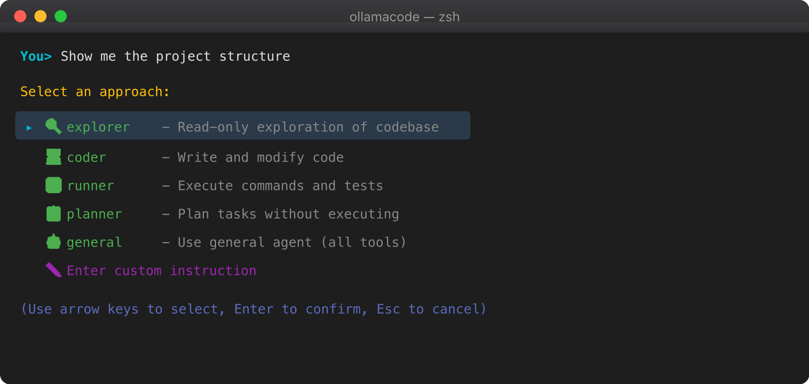
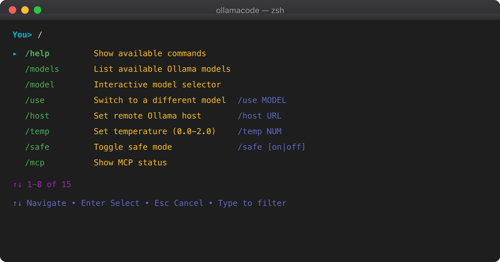
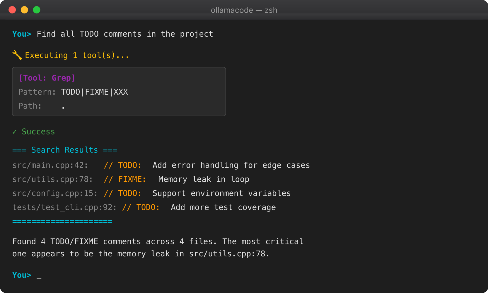
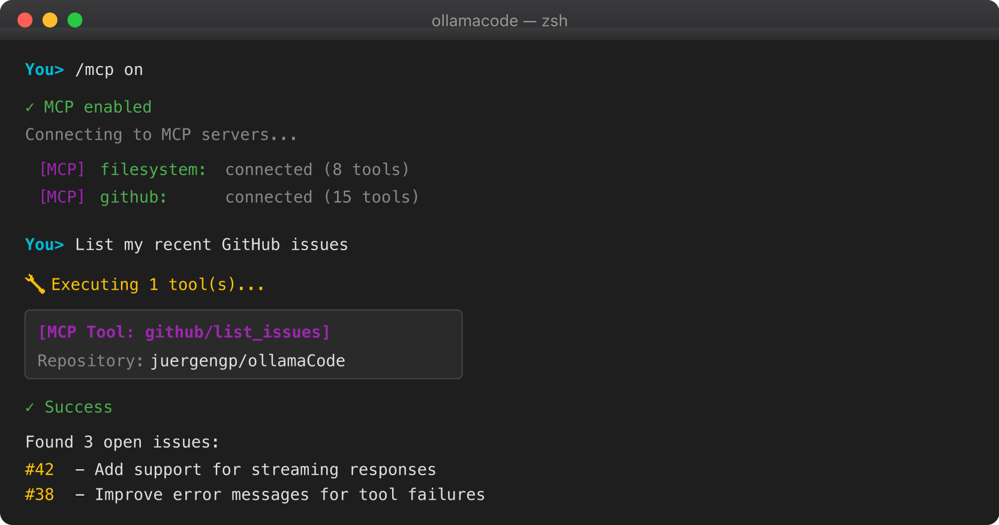

<p align="center">
  
</p>

<h1 align="center">Casper</h1>

<p align="center">
  <strong>Agentic AI assistant powered by local LLMs - chat, agents, tools, all local</strong>
</p>

<p align="center">
  <a href="#features">Features</a> •
  <a href="#quick-start">Quick Start</a> •
  <a href="#macos-gui">macOS GUI</a> •
  <a href="#mcp-support">MCP Support</a> •
  <a href="#installation">Installation</a> •
  <a href="#documentation">Documentation</a>
</p>

<p align="center">
  
  
  
  
  
</p>

---

## What's New in v2.3.1

- **🎉 Renamed to Casper** - Your friendly local AI assistant
- **New tagline** - "Local AI. Real power."
- **Updated branding** - New ASCII banner and CLI identity

### v2.3.0

- **🔧 Custom Model Builder** - Create custom LLMs with Modelfile support (`/model create`)
- **📦 Model Management** - Pull, push, copy, delete models with progress tracking
- **📝 Prompt Database** - Store, organize, and reuse prompts with categories
- **🔑 License System** - Tiered licensing (Free, Basic, Pro, Enterprise)
- **New Commands** - `/model`, `/prompt`, `/license` command families

### v2.2.0

- **🌐 Searcher Agent** - Web research with DuckDuckGo search and web spider
- **🗄️ Database Agent** - Query SQLite, PostgreSQL, and MySQL databases
- **🧠 Learner Agent** - RAG (Retrieval-Augmented Generation) with vector database
- **Embedding Support** - Via Ollama models or local hash-based fallback
- **Vector Database Backends** - SQLite, ChromaDB, FAISS support
- **New Tools** - WebSearch, WebFetch, DBConnect, DBQuery, DBExecute, DBSchema, Learn, Remember, Forget

### v2.1.0

- **Native macOS GUI** - Brand new SwiftUI-based native app with full feature parity
- **Model Selector** - Switch between Ollama models directly from the toolbar
- **Visual Tool Confirmation** - Approve/deny tool executions with a modern UI
- **Session Management** - Save, load, and export conversations

### v2.0.5

- **Fixed Slash Menu Positioning** - Command menu now stays in fixed position when near terminal bottom

### v2.0.4

- **Remote Ollama Support** - New `/host` command to connect to remote Ollama instances
- **Specialized Agent System** - Automatic task analysis with agent suggestions (Explorer, Coder, Runner, Planner)
- **Interactive Selection Menus** - Arrow-key navigation for agent and tool selection (like Claude Code)
- **Diff Display for Code Changes** - Shows lines added/removed when editing files
- **Fixed Tool Parsing** - Improved XML parsing for reliable tool execution with all Ollama models

---

## What is Casper?

**Casper** brings the power of AI coding assistants to your local machine. It's like having Claude Code or GitHub Copilot, but running entirely on your hardware with your choice of open-source LLMs via [Ollama](https://ollama.ai).

<p align="center">
  
</p>

## Features

### Core Capabilities

| Feature | Description |
|---------|-------------|
| **Local AI** | Run powerful LLMs locally - no API keys, no cloud, complete privacy |
| **Tool Execution** | AI can read files, run commands, search code, and edit files |
| **Specialized Agents** | Explorer, Coder, Runner, Planner agents with focused capabilities |
| **MCP Protocol** | Connect to external services via Model Context Protocol |
| **Interactive CLI** | Beautiful terminal interface with syntax highlighting |
| **Multi-Model** | Switch between models on the fly (`/model`) |
| **Safe Mode** | Command allowlists and confirmation prompts |

### Built-in Tools

The AI assistant has access to these tools to help with your tasks:

```
┌────────────┬────────────────────────────────────────────────────┐
│ Tool       │ Description                                        │
├────────────┼────────────────────────────────────────────────────┤
│ Bash       │ Execute shell commands with safety controls        │
│ Read       │ Read file contents                                 │
│ Write      │ Create or overwrite files                          │
│ Edit       │ Make targeted edits to existing files              │
│ Glob       │ Find files by pattern (e.g., **/*.py)              │
│ Grep       │ Search for text/patterns in files                  │
├────────────┼────────────────────────────────────────────────────┤
│ WebSearch  │ Search the web (DuckDuckGo/Brave)                  │
│ WebFetch   │ Fetch and parse web pages                          │
├────────────┼────────────────────────────────────────────────────┤
│ DBConnect  │ Connect to SQLite/PostgreSQL/MySQL                 │
│ DBQuery    │ Execute SELECT queries                             │
│ DBExecute  │ Execute INSERT/UPDATE/DELETE (with confirmation)   │
│ DBSchema   │ Show database schema                               │
├────────────┼────────────────────────────────────────────────────┤
│ Learn      │ Index content into vector database                 │
│ Remember   │ Query vector database for context                  │
│ Forget     │ Remove content from vector database                │
└────────────┴────────────────────────────────────────────────────┘
```

### Specialized Agents

Casper includes specialized agents that focus on specific tasks with curated tool access:

```
┌─────────────┬─────────────────────────────────────┬──────────────────────────────────┐
│ Agent       │ Description                         │ Available Tools                  │
├─────────────┼─────────────────────────────────────┼──────────────────────────────────┤
│ 🔍 Explorer │ Read-only codebase exploration      │ Glob, Grep, Read                 │
│ 💻 Coder    │ Write and modify code               │ Read, Write, Edit, Glob          │
│ ▶️ Runner   │ Execute commands and tests          │ Bash, Read                       │
│ 📋 Planner  │ Plan tasks without executing        │ Glob, Grep, Read                 │
│ 🌐 Searcher │ Web search and research             │ WebSearch, WebFetch, Read        │
│ 🗄️ Database │ Query and analyze databases         │ DBConnect, DBQuery, DBSchema     │
│ 🧠 Learner  │ RAG learning and retrieval          │ Learn, Remember, Forget, Read    │
│ 🤖 General  │ Full assistant (default)            │ All tools                        │
└─────────────┴─────────────────────────────────────┴──────────────────────────────────┘
```

When you enter a prompt, Casper analyzes your task and suggests the most appropriate agent:

<p align="center">
  
</p>

### MCP (Model Context Protocol) Support

Connect your local Ollama models to external tools and services:

```
┌─────────────────┐     MCP Protocol     ┌──────────────┐
│   Casper    │ ◄──────────────────► │  MCP Servers │
│  (Ollama LLM)   │     (JSON-RPC)       │  - GitHub    │
└─────────────────┘                      │  - Filesystem│
                                         │  - Database  │
                                         │  - Web Search│
                                         └──────────────┘
```

**Available MCP Servers:**
- **filesystem** - Access local files and directories
- **github** - Interact with GitHub repositories
- **brave-search** - Web search capabilities
- **sqlite** - Query SQLite databases
- **puppeteer** - Browser automation
- And many more from the [MCP ecosystem](https://github.com/modelcontextprotocol/servers)

## Quick Start

### 1. Install Ollama

```bash
# macOS / Linux
curl -fsSL https://ollama.ai/install.sh | sh

# Start Ollama
ollama serve
```

### 2. Pull a Model

```bash
# Recommended models for tool use
ollama pull llama3.1        # Good balance of speed and capability
ollama pull qwen2.5:14b     # Excellent at following instructions
ollama pull qwen3:4b        # Fast and lightweight
ollama pull codellama       # Optimized for coding tasks
```

### 3. Install Casper

```bash
# Option A: Download universal binary (recommended)
curl -L https://github.com/juergengp/Casper/releases/latest/download/casper-macos-universal -o casper
chmod +x casper
sudo mv casper /usr/local/bin/

# Option B: Build from source
git clone https://github.com/juergengp/Casper.git
cd Casper/cpp
mkdir build && cd build
cmake ..
make
sudo cp casper /usr/local/bin/
```

### 4. Run!

```bash
# Interactive mode
casper

# Single prompt
casper "Explain this codebase structure"

# With MCP enabled
casper --mcp

# Connect to remote Ollama instance
casper
/host http://192.168.1.100:11434
```

## macOS GUI

Casper also includes a **native macOS GUI application** built with SwiftUI. It provides the same powerful features as the CLI in a modern graphical interface.

### Features

- **Native SwiftUI Interface** - Modern macOS app with familiar UI patterns
- **Full Agent Support** - Explorer, Coder, Runner, Planner, and General agents
- **Tool Execution** - Visual tool confirmation with approve/deny per operation
- **Streaming Responses** - See AI responses as they're generated
- **Session Management** - Save, load, and export conversations
- **Shared Configuration** - Uses the same SQLite config as the CLI

### Building the GUI

```bash
# Install XcodeGen
brew install xcodegen

# Generate Xcode project
cd gui
xcodegen generate

# Open in Xcode and build (Cmd+R)
open OllamaCode.xcodeproj
```

**Requirements:** macOS 13.0+, Xcode 15+

See [gui/README.md](gui/README.md) for detailed build instructions.

---

## Screenshots

### Interactive Slash Commands
Type `/` to access the interactive command menu with arrow-key navigation:

<p align="center">
  
</p>

### Tool Execution
The AI can search code, read files, execute commands, and more:

<p align="center">
  
</p>

### MCP Integration
Connect to external services like GitHub, databases, and more:

<p align="center">
  
</p>

---

## Usage Examples

### Code Analysis

```bash
You> Analyze the main.cpp file and suggest improvements

🔧 Executing 1 tool(s)...
[Tool: Read]
File: main.cpp

✓ Success

I've analyzed main.cpp. Here are my suggestions:

1. **Error Handling**: Line 42 lacks proper error handling...
2. **Memory Management**: Consider using smart pointers...
3. **Code Organization**: The function on line 78 is too long...
```

### File Operations

```bash
You> Create a Python script that reads JSON files

🔧 Executing 1 tool(s)...
[Tool: Write]
File: read_json.py

✓ File written successfully
Lines written: 25

I've created read_json.py with the following features:
- Reads JSON files from command line arguments
- Pretty prints the content
- Handles errors gracefully
```

### Search and Navigate

```bash
You> Find all files that import the Config class

🔧 Executing 1 tool(s)...
[Tool: Grep]
Pattern: import.*Config|from.*import.*Config
Mode: files_with_matches

=== Search Results ===
src/main.py
src/utils/settings.py
tests/test_config.py
=====================

Found 3 files that import Config.
```

### Remote Ollama

```bash
# Connect to Ollama on another machine
You> /host http://192.168.1.100:11434
✓ Ollama host set to: http://192.168.1.100:11434
✓ Connected! 5 models available.

# Check current host
You> /host
Current host: http://192.168.1.100:11434

# Switch back to local
You> /host localhost:11434
✓ Ollama host set to: http://localhost:11434
✓ Connected! 7 models available.
```

### MCP Integration

```bash
# Enable MCP and connect to GitHub
You> /mcp on
✓ MCP enabled
Connecting to MCP servers...
  [MCP] github: connected (15 tools)

You> List my recent GitHub issues

🔧 Executing 1 tool(s)...
[MCP Tool: github/list_issues]

Found 5 open issues:
1. #42 - Add support for streaming responses
2. #38 - Improve error messages
...
```

## Interactive Commands

| Command | Description |
|---------|-------------|
| `/help` | Show available commands |
| `/models` | List available Ollama models |
| `/model` | Interactive model selector |
| `/use MODEL` | Switch to a specific model |
| `/host URL` | Set remote Ollama host |
| `/temp NUM` | Set temperature (0.0-2.0) |
| `/safe on/off` | Toggle safe mode |
| `/auto on/off` | Toggle auto-approve for tools |
| `/mcp` | Show MCP status |
| `/mcp on/off` | Enable/disable MCP |
| `/mcp tools` | List available MCP tools |
| `/config` | Show current configuration |
| `/clear` | Clear the screen |
| `/exit` | Exit Casper |

### Agent Commands

| Command | Description |
|---------|-------------|
| `/agent` | Show current agent status |
| `/agent on/off` | Enable/disable agent selection mode |
| `/explore` | Switch to Explorer agent (read-only) |
| `/code` | Switch to Coder agent (code changes) |
| `/run` | Switch to Runner agent (commands) |
| `/plan` | Switch to Planner agent (planning) |
| `/search`, `/web` | Switch to Searcher agent (web research) |
| `/db`, `/database` | Switch to Database agent (SQL queries) |
| `/learn`, `/memory`, `/rag` | Switch to Learner agent (RAG knowledge) |
| `/general` | Switch to General agent (all tools) |

### Model Management Commands

| Command | Description |
|---------|-------------|
| `/model create` | Interactive custom model creation wizard |
| `/model show <name>` | Display detailed model information |
| `/model copy <src> <dst>` | Clone/copy a model |
| `/model delete <name>` | Delete a model |
| `/model pull <name>` | Download model from Ollama library |
| `/model push <name>` | Upload model to ollama.ai |

### Prompt Database Commands

| Command | Description |
|---------|-------------|
| `/prompt` | Interactive prompt selector |
| `/prompt add` | Add new prompt with category |
| `/prompt edit <name>` | Edit existing prompt |
| `/prompt delete <name>` | Delete a prompt |
| `/prompt list` | List all prompts |
| `/prompt search <query>` | Search prompts by name/content |
| `/prompt export <file>` | Export prompts to JSON |
| `/prompt import <file>` | Import prompts from JSON |

### License Commands

| Command | Description |
|---------|-------------|
| `/license` | Show license status and features |
| `/license activate <key>` | Activate a license key |
| `/license deactivate` | Remove current license |

## Configuration

### Main Configuration

Settings are stored in `~/.config/casper/config.db` (SQLite) and include:

- Model selection
- Temperature
- Max tokens
- Safe mode settings
- Auto-approve settings
- MCP enabled state

### License Tiers

| Feature | Free | Basic | Pro | Enterprise |
|---------|------|-------|-----|------------|
| Chat & Tools | ✓ | ✓ | ✓ | ✓ |
| Model Switch | ✓ | ✓ | ✓ | ✓ |
| Model Pull/Delete | ✓ | ✓ | ✓ | ✓ |
| Prompt Database | - | ✓ | ✓ | ✓ |
| Max Prompts | - | 50 | 500 | Unlimited |
| Custom Model Creation | - | - | ✓ | ✓ |
| Model Push/Copy | - | - | ✓ | ✓ |
| Prompt Export/Import | - | - | ✓ | ✓ |

### New v2.2.0 Settings

```
# Search
search_provider: duckduckgo | brave
search_api_key: <optional API key for Brave>

# Database
db_type: sqlite | postgresql | mysql
db_connection: <connection string or path>
db_allow_write: false (safety default)

# Vector Database
vector_backend: sqlite | chroma | faiss
vector_path: ~/.config/casper/vectors/

# Embeddings
embedding_provider: ollama | local
embedding_model: nomic-embed-text

# RAG
rag_enabled: true
rag_auto_context: true
rag_similarity_threshold: 0.7
rag_max_chunks: 5
```

### MCP Server Configuration

Configure MCP servers in `~/.config/casper/mcp_servers.json`:

```json
{
  "mcpServers": {
    "filesystem": {
      "command": "npx",
      "args": ["-y", "@modelcontextprotocol/server-filesystem", "/home/user/projects"],
      "enabled": true,
      "transport": "stdio"
    },
    "github": {
      "command": "npx",
      "args": ["-y", "@modelcontextprotocol/server-github"],
      "env": {
        "GITHUB_PERSONAL_ACCESS_TOKEN": "ghp_xxxxxxxxxxxx"
      },
      "enabled": true,
      "transport": "stdio"
    }
  }
}
```

See [docs/MCP_SETUP.md](docs/MCP_SETUP.md) for detailed MCP configuration.

## Recommended Models

| Model | Size | Best For | Tool Use |
|-------|------|----------|----------|
| `llama3.1` | 8B | General coding tasks | Excellent |
| `llama3.1:70b` | 70B | Complex reasoning | Excellent |
| `qwen2.5:14b` | 14B | Instruction following | Excellent |
| `qwen3:4b` | 4B | Fast responses, lightweight | Good |
| `codellama` | 7B | Code generation | Good |
| `mistral-nemo` | 12B | Balanced performance | Good |
| `deepseek-coder` | 6.7B | Code-specific tasks | Good |

## Installation

### Homebrew (macOS) - Recommended

```bash
brew tap juergengp/casper https://github.com/juergengp/Casper
brew install casper
```

### Pre-built Binary (macOS)

```bash
# Option A: Download universal binary directly
curl -L https://github.com/juergengp/Casper/releases/latest/download/casper-macos-universal -o casper
chmod +x casper
sudo mv casper /usr/local/bin/

# Option B: Clone and copy from repository
git clone https://github.com/juergengp/Casper.git
cd Casper
sudo cp bin/casper-universal /usr/local/bin/casper
```

**Available binaries:**
| Binary | Architecture |
|--------|--------------|
| `casper-macos-universal` | All Macs (recommended) |
| `casper-macos-arm64` | Apple Silicon (M1/M2/M3/M4) |
| `casper-macos-x86_64` | Intel Macs |

### Build from Source

**Requirements:**
- CMake 3.15+
- C++17 compiler (clang or gcc)
- libcurl
- SQLite3

**macOS:**
```bash
# Install dependencies
brew install cmake curl sqlite3

# Build
cd Casper/cpp
mkdir build && cd build
cmake ..
make
sudo cp casper /usr/local/bin/
```

**Linux (Debian/Ubuntu):**
```bash
# Install dependencies
sudo apt install cmake build-essential libcurl4-openssl-dev libsqlite3-dev

# Build
cd Casper/cpp
mkdir build && cd build
cmake ..
make
sudo cp casper /usr/local/bin/
```

**Linux (Fedora/RHEL):**
```bash
# Install dependencies
sudo dnf install cmake gcc-c++ libcurl-devel sqlite-devel

# Build
cd Casper/cpp
mkdir build && cd build
cmake ..
make
sudo cp casper /usr/local/bin/
```

## Documentation

| Document | Description |
|----------|-------------|
| [MCP_SETUP.md](docs/MCP_SETUP.md) | Complete MCP configuration guide |
| [MACOS_QUICKSTART.md](MACOS_QUICKSTART.md) | Quick start guide for macOS |
| [MACOS_SETUP.md](MACOS_SETUP.md) | Detailed macOS setup |

## Architecture

```
Casper/
├── bin/                    # Pre-built binaries
│   └── casper         # macOS binary
├── cpp/                    # C++ CLI source code
│   ├── include/           # Header files
│   │   ├── agent.h        # Agent system
│   │   ├── cli.h
│   │   ├── config.h
│   │   ├── license.h      # License system
│   │   ├── mcp_client.h   # MCP client
│   │   ├── model_manager.h # Model management
│   │   ├── ollama_client.h
│   │   ├── prompt_db.h    # Prompt database
│   │   ├── task_suggester.h # Task analysis
│   │   ├── tool_executor.h
│   │   └── tool_parser.h
│   ├── src/               # Implementation
│   │   ├── main.cpp
│   │   ├── agent.cpp      # Agent definitions
│   │   ├── cli.cpp
│   │   ├── license.cpp    # License validation
│   │   ├── mcp_client.cpp
│   │   ├── model_manager.cpp # Modelfile builder
│   │   ├── prompt_db.cpp  # Prompt storage
│   │   ├── task_suggester.cpp
│   │   └── ...
│   └── CMakeLists.txt
├── gui/                    # Native macOS GUI (SwiftUI)
│   ├── OllamaCode/        # Swift source code
│   │   ├── App/           # App entry point
│   │   ├── Views/         # SwiftUI views
│   │   ├── ViewModels/    # MVVM view models
│   │   ├── Models/        # Data models
│   │   └── Services/      # Business logic
│   └── project.yml        # XcodeGen config
├── docs/                   # Documentation
│   └── MCP_SETUP.md
└── examples/              # Example configurations
    └── mcp_servers.json
```

## Why Casper?

| Feature | Casper | Claude Code | GitHub Copilot |
|---------|------------|-------------|----------------|
| **Privacy** | 100% Local | Cloud | Cloud |
| **Cost** | Free | Subscription | Subscription |
| **Models** | Any Ollama model | Claude only | GPT only |
| **Offline** | Yes | No | No |
| **MCP Support** | Yes | Yes | No |
| **Open Source** | Yes | No | No |
| **Customizable** | Fully | Limited | Limited |

## Contributing

Contributions are welcome! Please feel free to submit a Pull Request.

1. Fork the repository
2. Create your feature branch (`git checkout -b feature/AmazingFeature`)
3. Commit your changes (`git commit -m 'Add some AmazingFeature'`)
4. Push to the branch (`git push origin feature/AmazingFeature`)
5. Open a Pull Request

## License

This project is licensed under the MIT License - see the [LICENSE](LICENSE) file for details.

## Acknowledgments

- [Ollama](https://ollama.ai) - For making local LLMs accessible
- [Anthropic](https://anthropic.com) - For the MCP protocol specification
- [nlohmann/json](https://github.com/nlohmann/json) - JSON library for C++

---

<p align="center">
  Made with ❤️ by <a href="https://core.at">Core.at</a>
</p>

<p align="center">
  <a href="https://github.com/juergengp/Casper/issues">Report Bug</a> •
  <a href="https://github.com/juergengp/Casper/issues">Request Feature</a>
</p>
